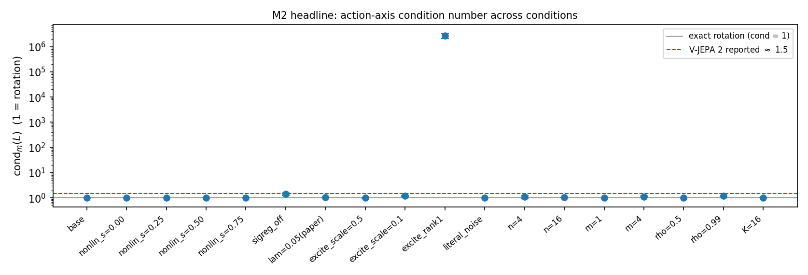
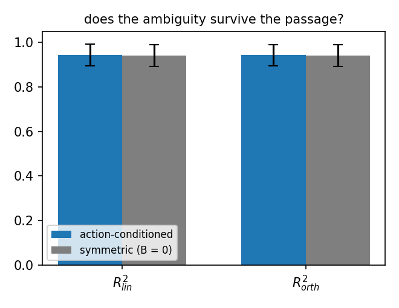
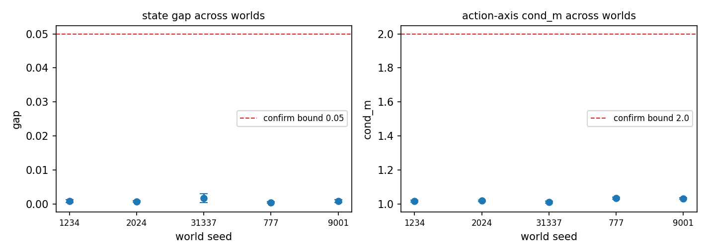

# Does the orthogonal identifiability ambiguity survive action-conditioning?

A minimal, controlled, ground-truth experiment on LeJEPA-style latent recovery in an
**action-conditioned** world — toy scale, every ground-truth quantity known exactly, every run
seeded, and the verdict rendered by decision rules fixed in code
([`verdict()`](src/metrics.py)), not written by hand. The experiment was specified before
implementation in [docs/SPEC.md](docs/SPEC.md); every deviation from that spec is argued and
measured, never silent ([NOTES.md](NOTES.md)).

> **Headline result — yes, it survives.** The model recovers the true action effect up to a
> rotation with condition number **1.018 ± 0.007** (1 = exact rotation; V-JEPA 2's reported value
> at scale is ≈ 1.5), and the gap between unrestricted-linear and orthogonal-Procrustes state
> recovery is **0.0009 ± 0.0005**: essentially everything that is linearly decodable is decodable
> by a rotation alone. Verdict under the pre-registered rules: **CONFIRMED** — with one
> pre-registered secondary check (dynamics, on the seed mean) **failing** and reported as such
> ([RESULTS.md](RESULTS.md)).



*Every condition sits near the exact-rotation line — except rank-deficient excitation
(`excite_rank1`, ≈ 10⁶), where the unexcited action direction is unidentifiable **in principle**:
the spike is the pre-registered prediction, not a failure.*

---

## 1. The question

LeJEPA (Balestriero & LeCun, 2025) trains joint-embedding models with no EMA teacher and no
stop-gradient: a single regularizer, **SIGReg**, pushes the embedding distribution toward an
isotropic Gaussian. A 2026 result by Klindt, LeCun & Balestriero proves that in a Gaussian world
with Ornstein–Uhlenbeck transitions observed through a nonlinear map, this training recovers the
true latents **up to an orthogonal transformation** — and the ambiguity is intrinsic, because the
target is rotation-invariant: if $`f`$ attains the optimum, so does $`O \circ f`$ for any
orthogonal $`O`$. The theorem covers the **symmetric (action-free) case only**.

Separately, V-JEPA 2 (Assran et al., 2025) — an action-conditioned world model at scale — was
observed to recover its action axis up to a near-rotation (condition number ≈ 1.5). Whether the
orthogonal ambiguity *survives the passage to the action-conditioned regime* is open. Both
outcomes are a result: survival extends the identifiability picture; distortion beyond a rotation
sharpens the open problem.

## 2. The world (ground truth, frozen)

Latent state $`z_t \in \mathbb{R}^n`$ ($`n=8`$), i.i.d. actions
$`a_t \sim \mathcal{N}(0, \Sigma_a)`$ in $`\mathbb{R}^m`$ ($`m=2`$), linear-Gaussian transition
with a ground-truth action effect $`B`$:

```math
z_{t+1} \;=\; \rho\, z_t \;+\; B\, a_t \;+\; \eta_t,
\qquad \rho = 0.9,
\qquad \eta_t \sim \mathcal{N}(0, \Lambda)
```

The noise is **balanced**: the stationary covariance solves the Lyapunov equation
$`\Sigma = \rho^2 \Sigma + B \Sigma_a B^\top + \Lambda`$, so

```math
\Lambda \;=\; (1-\rho^2)\, I_n \;-\; B \Sigma_a B^\top
```

is the unique Gaussian noise making $`\mathcal{N}(0, I_n)`$ *exactly* stationary — the isotropy
that both the theory and SIGReg assume. With the spec's literal noise
$`(1-\rho^2) I`$ instead, the marginal inflates to
$`\Sigma_{\mathrm{lit}} = I + B\Sigma_a B^\top / (1-\rho^2)`$ and even a perfect learner is forced
to whiten — a condition-number artifact right where the headline metric looks. That variant is
kept as a measured ablation (`literal_noise`), not assumed away. Observations
$`x = g(z) \in \mathbb{R}^{64}`$ pass through a frozen random MLP with a nonlinearity knob
$`s \in [0,1]`$ (standardized two-stage mixture of a random semi-orthogonal linear map and the
MLP). 50k train / 10k held-out eval tuples $`(x_t, a_t, x_{t+1})`$.

## 3. The model and the loss

Encoder $`f_\theta : \mathbb{R}^{64} \to \mathbb{R}^K`$ (small MLP, $`K = n = 8`$ by default) and
a deliberately **linear** action-conditioned predictor, so the learned dynamics are read off as
matrices:

```math
P(\hat z, a) \;=\; \hat R\, \hat z \;+\; \hat B\, a \;+\; c
```

LeJEPA recipe — no teacher–student, no stop-gradient, collapse prevented by SIGReg alone:

```math
\mathcal{L} \;=\; (1-\lambda)\;
\mathbb{E}\big\|\, P(f(x_t), a_t) - f(x_{t+1}) \,\big\|^2
\;+\; \lambda\, \mathcal{L}_{\mathrm{SIGReg}},
\qquad \lambda = 0.5
```

SIGReg matches every 1-D projection of the embeddings to $`\mathcal{N}(0,1)`$ (Cramér–Wold) with
the Epps–Pulley characteristic-function statistic, for random unit directions $`u`$ resampled
every step:

```math
\mathcal{L}_{\mathrm{SIGReg}}
\;=\; \mathbb{E}_{u \sim \mathcal{S}^{K-1}}
\int_{-5}^{5}
\Big|\, \widehat{\varphi}_{u^\top f(x)}(t) \;-\; e^{-t^2/2} \,\Big|^2
\, e^{-t^2/2}\, dt
```

$`\lambda = 0.5`$ rather than the paper's 0.05 is a *measured* calibration, not a preference: at
toy scale the 0.05 penalty sits at a stable partial-collapse equilibrium (dead embedding
dimensions, R²_lin pinned at 0.50 — replicated across 5 seeds as the `lam=0.05(paper)` ablation).
See [NOTES.md](NOTES.md) for the equilibrium argument.

## 4. The metrics

All on the held-out split, 5 training seeds per condition, true latents $`Z`$ vs learned
$`\hat Z = f(X)`$, both centered.

**M1 — state up to rotation.** Unrestricted-linear vs orthogonal-Procrustes recovery. With
$`Q = U V^\top`$ from the SVD of $`\hat Z^\top Z`$ (semi-orthogonal when $`K > n`$) and the
optimal scalar $`c^\ast`$:

```math
R^2_{\mathrm{lin}} = \max_{W}\; R^2\!\big(Z,\, \hat Z W\big),
\qquad
R^2_{\mathrm{orth}} = R^2\!\big(Z,\, c^\ast \hat Z Q\big),
\qquad
\mathrm{gap} = R^2_{\mathrm{lin}} - R^2_{\mathrm{orth}} \;\ge\; 0
```

The **gap** is the identifiability signature: exactly the part of the linear relationship that a
rotation + scale cannot express.

**M2 — action axis up to rotation (headline).** Express the learned effect in true coordinates
and fit the residual map against the true $`B`$:

```math
L \;=\; \big(Q^\top \hat B\big)\, B^{+},
\qquad
\mathrm{cond}_m(L) \;=\; \frac{\sigma_1(L)}{\sigma_m(L)}
```

$`\mathrm{cond}_m = 1`$ for an exact scaled rotation, independently of the conditioning of
$`B`$; same scale as V-JEPA 2's ≈ 1.5. (The ratio is over the top-$`m`$ singular values: the
spec's all-$`n`$ ratio is $`+\infty`$ by construction whenever $`m < n`$, since
$`\mathrm{rank}(L) \le m`$ — a spec bug, fixed and disclosed.) Complement: principal angles
between $`\mathrm{col}(Q^\top \hat B)`$ and $`\mathrm{col}(B)`$.

**M3 — dynamics.** In aligned coordinates $`A = Q^\top \hat R\, Q`$:

```math
\hat\rho \;=\; \frac{\mathrm{tr}(A)}{n},
\qquad
D_{\mathrm{rel}} \;=\; \frac{\|A - \rho I_n\|_F}{\rho \sqrt{n}}
```

**Pre-registered verdict bands** (fixed in code before the sweep; see the verifiability caveat in
NOTES.md): gate R²_lin ≥ 0.90 with ≥ 80% converged seeds; **CONFIRMED** iff gap ≤ 0.05 ∧
cond_m ≤ 2.0 ∧ θ_max ≤ 15°; **BROKEN** iff gap > 0.15 ∨ cond_m > 5.0 ∨ θ_max > 30°.

## 5. Results

Full sweep: 19 conditions × 5 seeds = **95 runs**, single GPU (CUDA, torch 2.9.1+cu128),
64.5 min, world seed 1234, training seeds 0–4. Raw per-run table committed at
[results/metrics.csv](results/metrics.csv) — the verdict and every aggregate are
machine-reproducible from it (one-liner in [RESULTS.md](RESULTS.md)); figures regenerate from the
CSV (provenance details: [results/README.md](results/README.md)).

| condition | R²_lin | R²_orth | gap | cond_m | θ_max (°) |
|---|---|---|---|---|---|
| **base (action-conditioned)** | **0.943 ± 0.054** | **0.942 ± 0.054** | **0.0009 ± 0.0005** | **1.018 ± 0.007** | **1.14 ± 0.20** |
| symmetric (B = 0, proven regime) | 0.940 ± 0.054 | 0.939 ± 0.055 | 0.0005 ± 0.0001 | — | — |
| SIGReg off (λ = 0) | 0.006 ± 0.001 | 0.004 ± 0.000 | — collapse — | — | — |
| paper-default λ = 0.05 | 0.501 ± 0.006 | 0.493 ± 0.005 | 0.008 | 1.042 | 2.83 |
| excitation scale 0.1 | 0.940 ± 0.054 | 0.940 ± 0.054 | 0.0005 | 1.192 ± 0.075 | 11.24 |
| rank-1 actions (unexcited dir.) | 0.941 ± 0.056 | 0.941 ± 0.057 | 0.0007 | ~10⁶ (degenerate) | 2.06 |
| literal-spec noise | 0.945 ± 0.050 | 0.939 ± 0.049 | 0.0055 ± 0.0001 | 1.028 ± 0.006 | 1.43 |

Three controls carry the story. Removing SIGReg collapses everything — the Gaussian constraint is
load-bearing, as the theory predicts. The symmetric and action-conditioned worlds recover the
state equally well (ΔR²_orth = 0.0024 against a seed std of ≈ 0.054): **the ambiguity survives
the passage**. And weakening the excitation degrades *only* the action-axis metric — down to a
provably unidentifiable direction under rank-1 actions — while state recovery stays intact.



**Pre-registered extension (robustness).** The review questions on the main sweep were turned
into a second grid whose thresholds were committed *before* execution
([scripts/sweep_extended.py](scripts/sweep_extended.py), 115 further runs,
[results/metrics_ext.csv](results/metrics_ext.csv)). All four quantitative predictions passed:
**4/5 fresh worlds CONFIRM** (the fifth misses only the R² gate, by 0.001, from optimization-basin
frequency — its cond_m is 1.011); the λ calibration is an enforcement **window** (λ\* = 0.5;
λ = 0.8 starves alignment); the lin–orth gap grows **monotonically with overcompleteness**
(0.0009 → 0.1057 for K = 8 → 24); and `n=16` / `ρ=0.99` are **walls, not budget artifacts**
(2× steps moves them by < +0.05). The suboptimal basin occurs in 23% of base runs across all
worlds, with a clean spectral signature (complex eigenvalue pairs — a *rotating* suboptimal
solution) — and even inside it the action axis stays rotational (cond_m = 1.022).



Full per-condition tables (19 + 23 conditions), the failed dynamics check and its seed-level
anatomy, the λ window, and the refined reading of the literal-noise artifact:
**[RESULTS.md](RESULTS.md)**.

## 6. Reproduce

```bash
pip install -r requirements.txt

python tests/smoke_test.py          # seconds: SIGReg sanity + metrics self-test + tiny pipeline
python scripts/sweep.py --quick     # ~1 min:  full code path on toy dimensions (NOT science)
python scripts/sweep.py             # the real experiment: 95 runs, ~1 h on a single GPU
python -m src.run --lam 0 --label sigreg_off   # any single condition, config-driven via argparse
```

Reproducibility, stated exactly: bitwise on CPU; on CUDA/MPS some kernels have no deterministic
variant, so individual runs reproduce statistically — every conclusion rests on mean ± std across
5 training seeds, never a single run. `requirements.lock.txt` pins the local (macOS) verification
environment; the analyzed run used torch 2.9.1+cu128.

## 7. Repository layout

```
src/config.py      # Config dataclass, seeding, device, paths
src/world.py       # synthetic world (frozen g, ground-truth B, rho, balanced noise)
src/model.py       # encoder, action-conditioned linear predictor
src/sigreg.py      # SIGReg (sliced Epps-Pulley CF matching, real arithmetic)
src/train.py       # LeJEPA training loop (no EMA, no stop-gradient)
src/metrics.py     # M1/M2/M3, Procrustes, condition number + pre-registered verdict
src/run.py         # one experiment from a config
scripts/sweep.py   # the ablation grid, results CSV, figures, verdict
scripts/sweep_extended.py   # the pre-registered robustness extension
tests/smoke_test.py
docs/SPEC.md       # the experiment specification this repo implements
results/           # the runs' raw metrics CSVs + figures (provenance: results/README.md)
RESULTS.md         # full results & interpretation            NOTES.md  # design rationale
```

## 8. Limitations, and what this opens

Toy scale by design: linear-Gaussian dynamics, $`n = 8`$, a frozen smooth observation map. This is
an empirical result in a world satisfying the theory's assumptions — not a theorem, and not
evidence about web-scale models (the V-JEPA 2 number anchors the metric's scale, nothing more).
The boundary is measured, not suspected (pre-registered extension): $`n = 16`$ and
$`\rho = 0.99`$ are walls at this scale (2× budget moves them by < 0.05); overcompleteness erodes
the rotational signature monotonically (gap 0.0009 → 0.1057 for $`K`$ = 8 → 24); and a rotating
suboptimal optimization basin (complex eigenvalue pairs) catches 23% of runs across five worlds,
defeating mean-based criteria — the multi-seed protocol catches *it*. What this opens: the
action-conditioned identifiability *proof* (this repo is its testbed), richer worlds (nonlinear
dynamics, partial observability), and whether the condition-number diagnostic predicts planning
performance at scale. Research statement: link to be added.

## References

1. R. Balestriero, Y. LeCun. *LeJEPA: Provable and Scalable Self-Supervised Learning Without the
   Heuristics.* arXiv:2511.08544, 2025.
2. D. Klindt, Y. LeCun, R. Balestriero (2026). Identifiability of LeJEPA-style training in
   Gaussian latent worlds, symmetric case. *(Result as described in [docs/SPEC.md](docs/SPEC.md);
   full bibliographic record pending publication.)*
3. M. Assran et al. *V-JEPA 2: Self-Supervised Video Models Enable Understanding, Prediction and
   Planning.* arXiv:2506.09985, 2025. (The "condition number ≈ 1.5" anchor used throughout is the
   observation as described in [docs/SPEC.md](docs/SPEC.md) — a scale anchor, not a re-measured
   baseline.)
4. T. W. Epps, L. B. Pulley. *A test for normality based on the empirical characteristic
   function.* Biometrika 70(3), 1983.
5. P. H. Schönemann. *A generalized solution of the orthogonal Procrustes problem.* Psychometrika
   31(1), 1966.

MIT License — © 2026 Sid Ahmed Bouamama.
